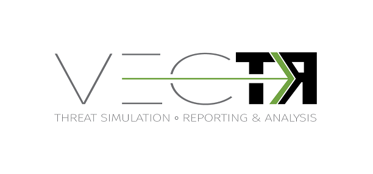

# 

VECTR is a tool that facilitates tracking of your red and blue team testing activities to measure detection and prevention capabilities across different attack scenarios.  VECTR provides the ability to create assessment groups, which consist of a collection of Campaigns and supporting Test Cases to simulate adversary threats.  Campaigns can be broad and span activity across the kill chain, from initial compromise to privilege escalation and lateral movement and so on, or can be a narrow in scope to focus on specific detection layers, tools, and infrastructure.  VECTR is designed to promote full transparency between offense and defense, encourage training between team members, and improve detection & prevention success rate across the environment.   

VECTR is focused on common indicators of attack and behaviors that may be carried out by any number of threat actor groups, with varying objectives and levels of sophistication.  VECTR can also be used to replicate the step-by-step TTPs associated with specific groups and malware campaigns, however its primary purpose is to replicate attacker behaviors that span multiple threat actor groups and malware campaigns, past, present and future.  VECTR is meant to be used over time with targeted campaigns, iteration, and measureable enhancements to both red team skills and blue team detection capabilities.  Ultimately the goal of VECTR is to make a network resilient to all but the most sophisticated adversaries and insider attacks.

## Environment Notes

### Docker Windows

So far we are not able to get Docker on Windows to work properly.  The mongo container will not persist data to docker-compose volumes.  This may be related to how mongo saves data in addition to how file permissions work for the Windows base Docker VM.  We've seen discussion about named volumes working, but we haven't investigated this yet.

## Linux Docker Installation (Preferred)

1. Install [Docker Engine](https://docs.docker.com/engine/installation/) and [Docker Compose](https://docs.docker.com/compose/install/).
2. Download the [release package](https://github.com/SecurityRiskAdvisors/VECTR/releases/latest).
3. Verify the content of the package.
	
	```sh
	$ ls -R
	.:
	backup  config  dev.yml  docker-compose.yml  Dockerfile  dumpfiles  migrationbackups  migrationlogs    wars 

	./backup:

	./config:
	vectr.properties

	./dumpfiles:

	./migrationbackups:

	./migrationlogs:

	./wars:
	ROOT  sra-oauth2-rest.war  sra-purpletools-rest.war  sra-purpletools-webui.war

	./wars/ROOT:
	index.jsp 
	```
4. Run `docker compose` from the top directory where docker-compose.yml is located. Proxy configurations might need to be added to the YAML file in order for the containers to have internet access if your environment requires proxies. In addition to the docker-compose.yml, an environment-specific configuration file, dev.yml is included. You may define the port and volume usages for individual environments using a configuration like this.

	```sh
	$ sudo docker-compose -f docker-compose.yml -f dev.yml -p dev up -d
	Creating vectr_mongo
	Creating vectr_tomcat
	```
	
5. Check the status of the containers with `docker ps`.

	```sh
	$ sudo docker ps
	CONTAINER ID        IMAGE                         COMMAND                  CREATED             STATUS              PORTS                                            NAMES
	d7a87f88bb71        vectr_tomcat:latest           "catalina.sh run"        4 seconds ago       Up 2 seconds        0.0.0.0:8080->8080/tcp                           vectr_tomcat
	dcf593d84e1e        mongo:3.2.3                   "/entrypoint.sh mongo"   5 seconds ago       Up 4 seconds        0.0.0.0:27017->27017/tcp                         vectr_mongo
	```

## Windows Bare Metal Installation	

1.  Install Tomcat 
2.  Install Mongodb
3.  Install JDK
4.  Setup Environment Variables:

		JAVA_HOME=/path/to/jdk

		MONGODB_HOME=/path/to/mongodb
              
5.  Append to PATH environment variable:

		PATH=...;%JAVA_HOME%\bin;%MONGODB_HOME%\bin
              
6.  Make sure you have C:\data\db 
             
7.  Start the mongodb process.  
			  
7.  Edit catalina.properties in TOMCAT_HOME\conf\catalina.properties. 
			  
		shared.loader="${catalina.base}/app_conf" 
 
8.  Place vectr.properties from the config/ folder in app_conf

9.  Place the wars in TOMCAT_HOME/webapps

10.  Navigate to 127.0.0.1:8080/sra-purpletools-webui/app
	
## Usage

The VECTR webapp is available at http://your_docker_host:8081/sra-purpletools-webui/app. Log in with the default admin credentials: user admin and password 11_ThisIsTheFirstPassword_11.  Please change your password after initial login in the user profile menu.

<!-- [](https://dply.co/b/OynYEP3G)
*Note: Server initialization on dply.co can take up to 10 minutes* -->

## General

* Presentation layer built on AngularJS with some Angular Material UI components
* Support for OAuth 2.0
* REST API powered by Apache CXF and JAX-RS
* Support for TLS endpoints (for VECTR Community Edition you will need to obtain your own trusted certificate, the tool does not ship with an untrusted self-signed cert)

## Documentation

### Feature Breakdowns By Release

[VECTR v4.2 Feature Breakdown](https://github.com/SecurityRiskAdvisors/VECTR/blob/master/media/VECTR%20v4_2%20Feature%20Breakdown.pdf)

## Team

* Carl Vonderheid - Lead Programmer
* Bowei Zhang - Progammer
* Galen Fisher - Programmer
* Nick Galante - Programmer
* Phil Wainwright - Design & Requirements
* Doug Webster - Graphic Designer & Marketing

[](https://securityriskadvisors.com)

## License

Please see the [EULA](./VECTR%20End%20User%20License%20Agreement.pdf)
