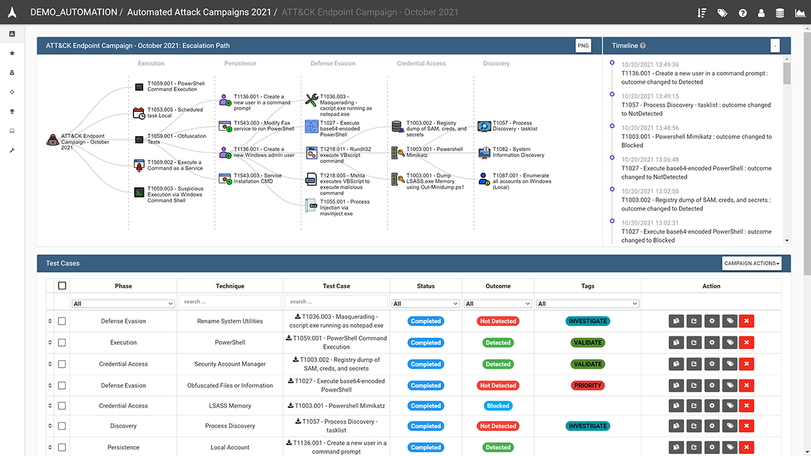
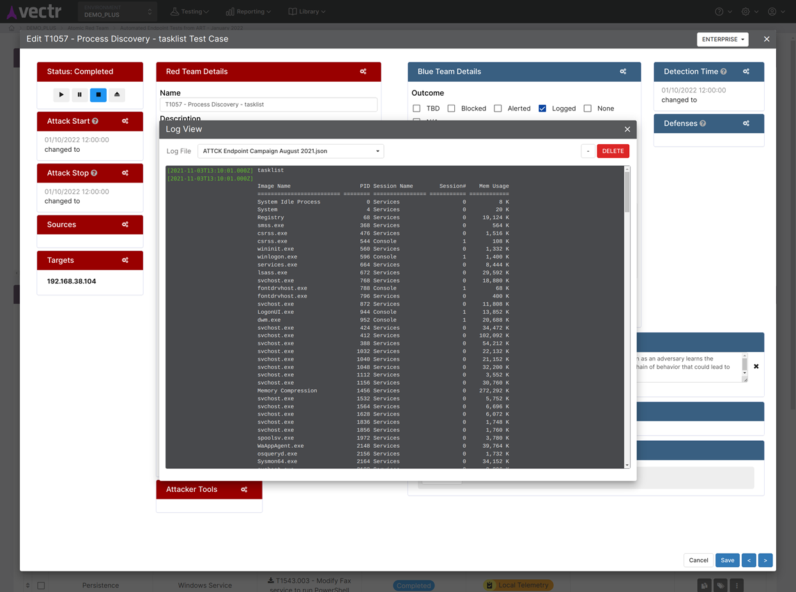

  

####

VECTR documentation:
[https://docs.vectr.io](https://docs.vectr.io)

VECTR Community Discord Channel:
[https://discord.gg/2FRd8zf728](https://discord.gg/2FRd8zf728)

VECTR is a tool that facilitates tracking of your red and blue team testing activities to measure detection and prevention capabilities across different attack scenarios.  VECTR provides the ability to create assessment groups, which consist of a collection of Campaigns and supporting Test Cases to simulate adversary threats.  Campaigns can be broad and span activity across the kill chain, from initial compromise to privilege escalation and lateral movement and so on, or can be a narrow in scope to focus on specific detection layers, tools, and infrastructure.  VECTR is designed to promote full transparency between offense and defense, encourage training between team members, and improve detection & prevention success rate across the environment.   

VECTR is focused on common indicators of attack and behaviors that may be carried out by any number of threat actor groups, with varying objectives and levels of sophistication.  VECTR can also be used to replicate the step-by-step TTPs associated with specific groups and malware campaigns, however its primary purpose is to replicate attacker behaviors that span multiple threat actor groups and malware campaigns, past, present and future.  VECTR is meant to be used over time with targeted campaigns, iteration, and measurable enhancements to both red team skills and blue team detection capabilities.  Ultimately the goal of VECTR is to make a network resilient to all but the most sophisticated adversaries and insider attacks.

# 

# 

# 

# 

# 

## Getting Started

See the [Install Guide](https://docs.vectr.io/Installation/).

### Supported Platforms

* Current Ubuntu LTS Releases (18.04 - 22.04)

Community support is primarily limited to Ubuntu LTS Releases. If you encounter issues feel free to open an issue on [GitHub](https://github.com/SecurityRiskAdvisors/VECTR) or join us on [Discord](https://discord.gg/VEDtmCrCpj).

VECTR should run in most containerization environments. If in enterprise we recommend consulting your Infrastructure/Containerization team for guidance. Or reach out directly via the [contact form](https://vectr.io/) at bottom of page for a consulting engagement.

Please read the instructions carefully for [Upgrading a VECTR instance](https://docs.vectr.io/Upgrading-an-existing-VECTR-installation/).

#### Browsers

Most modern browsers, such as Chrome, Firefox, Edge (Chromium) up to two prior releases are supported. We recommend using the latest of either:

* Chrome 
* Firefox
	
## General

* Presentation layer built on Vue 3 with some legacy AngularJS components.
* GraphQL API
* Support for TLS endpoints (VECTR Community Edition will auto-generate an untrusted self-signed cert or can be supplied with certs).

## Contributors

* Galen Fisher
* Ryan Fortin
* James Geraghty
* Zara Gunner
* Dan Guzek
* Patrick Hislop
* Daniel Hong
* Fevzi Kipici
* Bhavika Patel
* Paul Spencer
* Carl Vonderheid
* Phil Wainwright

## License

Please see the [EULA](./VECTR%20End%20User%20License%20Agreement.pdf)

Atomic Red [LICENSE](https://github.com/redcanaryco/atomic-red-team/blob/master/LICENSE.txt)

