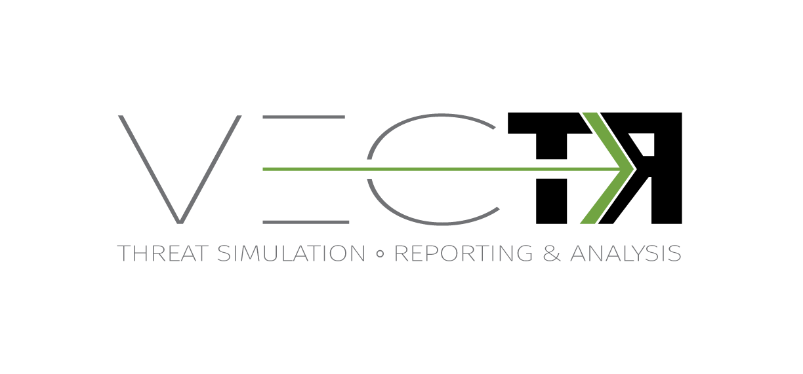
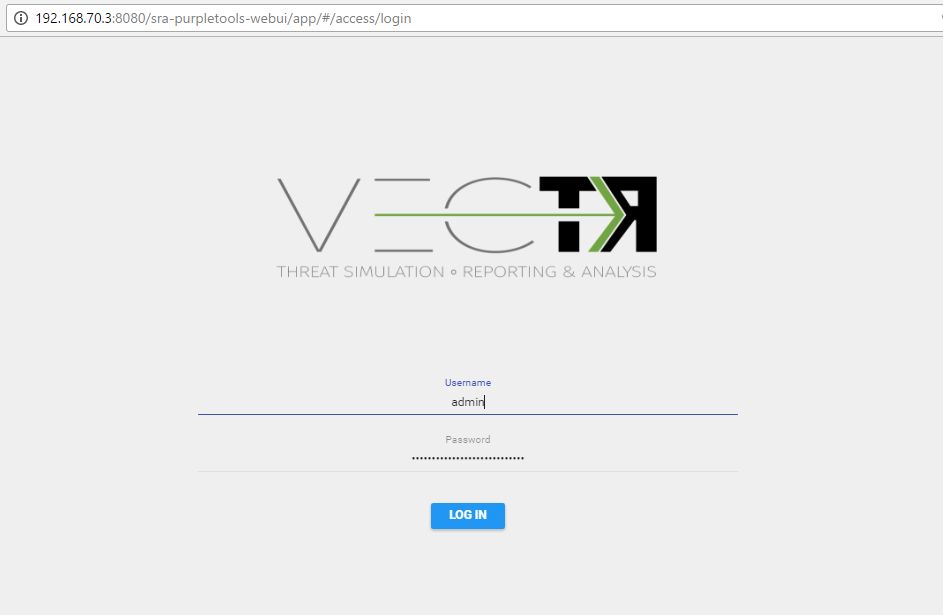

# 

VECTR is a tool that facilitates tracking of your red and blue team testing activities to measure detection and prevention capabilities across different attack scenarios.  VECTR provides the ability to create assessment groups, which consist of a collection of Campaigns and supporting Test Cases to simulate adversary threats.  Campaigns can be broad and span activity across the kill chain, from initial compromise to privilege escalation and lateral movement and so on, or can be a narrow in scope to focus on specific detection layers, tools, and infrastructure.  VECTR is designed to promote full transparency between offense and defense, encourage training between team members, and improve detection & prevention success rate across the environment.   

VECTR is focused on common indicators of attack and behaviors that may be carried out by any number of threat actor groups, with varying objectives and levels of sophistication.  VECTR can also be used to replicate the step-by-step TTPs associated with specific groups and malware campaigns, however its primary purpose is to replicate attacker behaviors that span multiple threat actor groups and malware campaigns, past, present and future.  VECTR is meant to be used over time with targeted campaigns, iteration, and measureable enhancements to both red team skills and blue team detection capabilities.  Ultimately the goal of VECTR is to make a network resilient to all but the most sophisticated adversaries and insider attacks.


## Installation

1. Install [Docker Engine](https://docs.docker.com/engine/installation/) and [Docker Compose](https://docs.docker.com/compose/install/).
2. Download the [release package](https://dummy.url/version.zip).
3. Verify the content of the package.
	
	```sh
	$ ls -R
	.:
	docker-compose.yml  Dockerfile  wars
	
	./wars:
	sra-oauth2-rest.war  sra-purpletools-rest.war  sra-purpletools-webui.war
	```
4. Run `docker compose` from the top directory where docker-compose.yml is located.

	```sh
	$ docker-compose up -d
	Creating vectr_mongo
	Creating vectr_tomcat
	```
	
5. Check the status of the containers with `docker ps`.

	```sh
	$ docker ps
	CONTAINER ID        IMAGE                         COMMAND                  CREATED             STATUS              PORTS                                            NAMES
	d7a87f88bb71        vectr_tomcat:latest           "catalina.sh run"        4 seconds ago       Up 2 seconds        0.0.0.0:8080->8080/tcp                           vectr_tomcat
	dcf593d84e1e        mongo:3.2.3                   "/entrypoint.sh mongo"   5 seconds ago       Up 4 seconds        0.0.0.0:27017->27017/tcp                         vectr_mongo
	```

## Usage

The VECTR webapp is available at `http://your_docker_host:8080/sra-purpletools-webui/app`. 
Log in with the default admin credentials: user `admin` and password `11_ThisIsTheFirstPassword_11`.



## Team

[](https://securityriskadvisors.com)

## License

MIT © [Security Risk Advisors](https://securityriskadvisors.com)